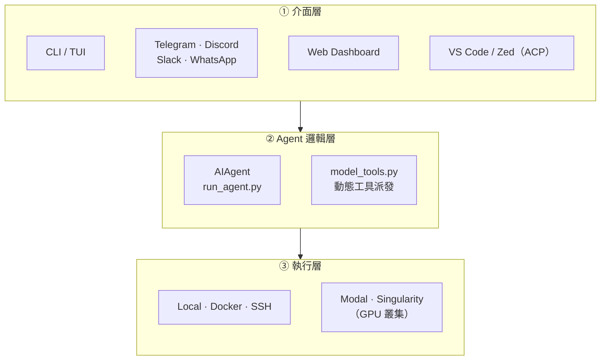
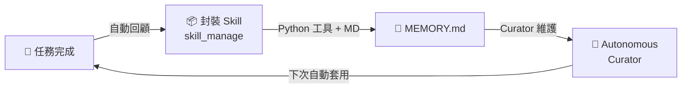

# Hermes Agent

### 自我改進 AI Agent 框架技術評估

  Nous Research ・ 技術評估報告 ・ 2026.06.12

---
layout: center
class: text-center
---

# 這個名字，不只是個名字

𓂀

  Hermes・Hermès・Harness

---
layout: default
---

# Hermes — 眾神的信使

  

    
⚡

    

      在希臘神話中，<strong class="text-amber-600">赫爾墨斯（Hermēs）</strong>是奧林匹斯十二主神中最靈活的一位——身兼眾神信使、商業之神、邊界之神。
    

    

      他穿梭於神界與人界之間，傳遞訊息、調度資源，從不受邊界束縛。
    

    

      讀音：英文 HUR-meez・法文 air-MEZ
    

  

  

    

      
📨 信使

      
在模型、工具與平台之間傳遞指令

    

    

      
🌐 邊界之神

      
自由穿越 Telegram、Slack、Discord 等邊界

    

    

      
⚡ 速度與智慧

      
快速、可靠地執行與學習

    

  

---
layout: default
---

# Hermès → Harness — 從馬具到 AI

  

    
🐎

    
Hermès 愛馬仕

    

      1837 年，創辦人 Thierry Hermès 開設<strong class="text-gray-900">高級馬具工坊</strong>，專為貴族馴馬、駕馭烈馬
    

  

  

    
🔧

    
Harness 馬具

    

      軟體工程中，<strong class="text-gray-900">Harness</strong> 指「測試框架或控制套件」——將難以預測的事物引導、馴服
    

  

  

    
🤖

    
Agent Harness

    

      <strong class="text-gray-900">駕馭大語言模型</strong>，將難以預測的 AI 引導發揮最大效能
    

  

  神話信使・奢華馬具・AI 框架——三個世界，同一個名字

---
layout: two-cols
---

# 專案概覽

<v-clicks>

- **名稱**：Hermes Agent
- **開發方**：Nous Research
- **授權**：MIT（可免費商用）
- **定位**：「The self-improving AI agent」
- **主要語言**：Python 82.6%、TypeScript 13.4%

</v-clicks>

::right::

  

    
195K

    
GitHub Stars

  

  

    
34.1K

    
Forks

  

  

    
1,415

    
Contributors

  

---
layout: default
---

# 核心特色：自我改進學習迴圈

  「Creates skills from <strong>experience</strong>, improves them during use, builds a <strong>deepening model</strong> of who you are across sessions」

  

    
🧠

    <strong>持久記憶</strong>
    
跨對話累積知識，不需每次重頭開始，搭配全文搜尋回溯歷史

  

  

    
⚡

    <strong>自動技能生成</strong>
    
從複雜任務中自動提取可複用技能，累積組織專屬知識庫

  

  

    
👤

    <strong>用戶建模</strong>
    
持續理解使用者偏好，個人化回應方式與工作流程

  

---
layout: default
---

# 多模型支援 — 200+ 模型，一套框架

  

| 提供商 | 類型 |
|--------|------|
| OpenRouter | 多模型聚合平台 |
| Nous Portal | Nous 自家模型 |
| OpenAI | GPT 系列 |
| NVIDIA NIM | 企業級推論 |
| Hugging Face | 開源模型 |
| 自訂 Endpoint | 本地 / 私有雲 |

  

  

    

      
💡 對企業的意義

      

        無需改動程式碼即可切換底層模型，降低廠商鎖定風險。未來若有更好或更便宜的模型，可隨時替換。
      

    

  

---
layout: default
---

# 部署彈性 — 從個人到企業規模

  

    <h3 class="text-green-700 mb-4">🚀 輕量部署</h3>
    <ul class="space-y-2 text-sm">
      <li>✅ 本機終端機（立即可用）</li>
      <li>✅ $5/月 VPS（低成本驗證）</li>
      <li>✅ Docker 容器化</li>
      <li>✅ SSH 遠端機器</li>
    </ul>
  

  

    <h3 class="text-blue-700 mb-4">🏢 企業部署</h3>
    <ul class="space-y-2 text-sm">
      <li>✅ GPU 叢集（Singularity）</li>
      <li>✅ Serverless（Modal）</li>
      <li>✅ 雲端沙箱（Daytona）</li>
      <li>✅ 多平台訊息閘道</li>
    </ul>
  

---
layout: default
---

# 多平台整合 — 在現有工具中使用 AI

Agent 透過主流通訊平台操作，使用者不需學新介面

  

    
💬

    
Telegram

  

  

    
🎮

    
Discord

  

  

    
💼

    
Slack

  

  

    
📱

    
WhatsApp

  

  

    
🔒

    
Signal

  

  📌 <strong>實際場景：</strong>工程師或業務人員直接在 Slack 發指令給 Agent，完成自動化任務，不需切換工具

---
layout: default
---

# 架構解析 — 三層設計

---
layout: default
---

# 架構解析 — Runtime Modes & 設定

  

    
四種啟動入口

| Mode | Entry Point |
|------|-------------|
| CLI | `cli.py` |
| 訊息平台 Gateway | `gateway/run.py` |
| Editor (ACP) | VS Code / Zed 整合 |
| Web UI | 瀏覽器 Dashboard |

  

  

    
HERMES_HOME（~/.hermes/）

    

      
config.yaml — 模型、工具設定

      
SOUL.md — Agent 人格定義

      
MEMORY.md — 長期記憶

      
.env — API 金鑰

    

  

---
layout: center
class: text-center
---

# 深入解析

六個值得關注的技術特色

---
layout: default
---

# Agent 越用越聰明：Learning Loop

  
✅ 重複任務零人工撰碼：同類需求第二次起自動套用

  
✅ 部門隔離：多 Profile 各自維護專屬 Skill Bundle

  
✅ 知識不腐化：Curator 自動合併 / 棄用過時 Skill

  ⚠️ 企業注意：自動生成的 Skill 無人工審核閘門，受監管環境需自建 code review 流程

---
layout: default
---

# `SOUL.md`：Agent 行為的版本控制單元

  

    
~/.hermes/SOUL.md

    

      # 身份 
      你是法務部門的 AI 助理。  
      # 行為邊界 
      不得提供具體法律建議。 
      回應需附加「請諮詢專業律師」。
    

    
啟動時注入 system prompt 前置區段

    

      → 可納入 Git 版控、PR review、CI/CD 
      ≈ <strong>IaC for Agent behavior</strong>
    

  

  

    
⚖️ 法務 Agent 合規語氣 + 免責提示

    
🎧 客服 Agent 親切語氣 + 退款授權範圍

    
🛠 工程 Agent 技術語氣 + 生產環境禁令

  

  ⚠️ 純文字，無原生 ACL — 有 HERMES_HOME 寫入權限者可靜默修改人格，建議搭配 OS 層或 Secret Manager 保護

---
layout: default
---

# 記憶不中斷：三層記憶架構

  

    

      
短期 — Context Window

      
當前對話即時推理，會話結束即消失

    

    
▼ 對話結束後寫入

    

      
中期 — SQLite FTS5 全文索引

      
跨會話關鍵字召回，毫秒級查詢 ／ Honcho 管理

    

    
▼ 重要資訊持久化

    

      
長期 — MEMORY.md + 向量 DB

      
USER.md 記錄使用者偏好 ／ Skill 知識庫

    

  

  

    

      💡 <strong>實際場景</strong> 
      三週後繼續同一專案，無需重新交代背景
    

    

      📋 <strong>稽核友善</strong> 
      MEMORY.md 為純文字，IT 可直接備份與審計
    

    

      ⚠️ 記憶邊界由 AI 自主決定，企業需評估資料治理策略
    

  

---
layout: default
---

# Promptware 防禦：對抗記憶污染攻擊

  

    
攻擊鏈（Brainworm-class）

    

      
📄 外部內容（網頁、文件、工具輸出）

      
▼ 混入惡意指令

      
💾 寫入 MEMORY.md / skill_manage

      
▼ 持久化感染

      
🔁 跨會話持續執行攻擊者指令

    

    

      🛡 v0.15.0 在記憶寫入路徑前加入攔截驗證
    

  

  

    
企業導入前確認清單

    
□ 防禦是否覆蓋 MCP 工具輸出？

    
□ 是否有第三方滲透測試報告？

    
□ 觸發日誌是否可稽核？

    

      MIT 開源 — 企業可自行審計防禦實作原始碼
    

  

---
layout: two-cols
class: kanban-slide
---

# Multi-agent Kanban 自癒能力

::right::

  
✅ 無人值守長任務：子代理失效不需人工介入

  
✅ 任務狀態可審計：Kanban 提供完整生命週期記錄

  
✅ 跨 session 持久化：配合 /goal 追蹤多日工作流

  

    ⚠️ v0.13.0 推出，尚無公開 benchmark — 建議 PoC 自行驗證可靠性
  

---
layout: default
---

# v0.15 Velocity：更精簡的程式碼，更穩固的基礎

  

    
76%

    
程式碼削減

    
功能不減，架構收斂

    

      
v0.12v0.13v0.14v0.15

      

        

      

      
28 天四版迭代

    

  

  

    

      
重構前

      四條平行執行路徑（CLI / Gateway / ACP / Web UI）各自維護
    

    
▼ 收斂

    

      
重構後

      單一 AIAgent 協調層統一入口
    

    

      
✅ 安全審計範圍縮小

      
✅ Bitwarden 原生 API Key 管理

    

    

      ⚠️ 距 v0.14 僅 12 天 — PoC 前確認測試覆蓋率
    

  

---
layout: default
---

# Tool Gateway — 一訂閱全工具齊備

  

    
隨 Nous Portal 訂閱包含

| 工具 | 說明 |
|------|------|
| 🔍 Web 搜尋 + 擷取 | Firecrawl 無速率限制 |
| 🎨 圖片生成 | FLUX 2 / GPT-Image / Ideogram 等 9 款 |
| 🔊 文字轉語音 | OpenAI TTS 等多款 |
| 🌐 瀏覽器自動化 | 雲端無頭 Chrome（Browser Use） |

  

  

    

      💡 <strong>不需另開帳號：</strong>不必分別申請 Firecrawl、FAL、Browser Use——Tool Gateway 統一路由
    

    

      🛠 企業自建：停用 gateway 改用內部基礎設施（use_gateway: false）
    

    

      ⚠️ 付費功能：Nous Portal 免費方案不含 Tool Gateway
    

  

---
layout: default
---

# Plugin 系統 — 三種擴充類型

  

    
🔧

    
Tools / Hooks

    
新增自訂工具 + 設置生命週期鉤子（logging、guardrails、webhooks）

    
hermes plugins install

  

  

    
🧠

    
Memory Provider

    
替換記憶後端：Honcho、Mem0、OpenViking、RetainDB 等跨 session 記憶

    
跨 session 個人化

  

  

    
📋

    
Context Engine

    
替換 context 管理，自訂檔案注入與壓縮策略

    
hermes plugins UI

  

  🔒 <strong>企業應用：</strong>Tools/Hooks plugin 可實作 <strong>guardrails</strong>——工具呼叫前後攔截審計，不需 fork 核心程式碼

---
layout: default
---

# 企業可靠性：多層模型保障

  

    

      
🗺 Provider Routing

      
依成本、速度、品質排序多個提供商，支援白名單 / 黑名單過濾

    

    

      
🔄 Fallback Providers

      
主要模型出錯時自動切換備援，視覺 / 壓縮任務有獨立 fallback

    

    

      
🔑 Credential Pools

      
多組 API Key 輪替，達速率上限自動換鑰，不中斷服務

    

    

      
⚡ Prompt Caching

      
跨 session 1 小時前綴快取（Claude / OpenRouter / Nous Portal），永遠開啟

    

  

  

    

      💡 <strong>SLA 保障</strong> 
      供應商限速或故障時零介入自動切換，服務不中斷
    

    

      💰 <strong>成本控管</strong> 
      Prompt caching 降低重複 context token 費用；Credential Pools 防單鑰達限
    

  

---
layout: center
class: text-center
---

# 實際落地案例

遊戲營運 AI Bot — 自然語言查 BigQuery 的實戰驗證

---
layout: default
---

# 遊戲營運 Bot：用中文提問，Bot 自動出報告

  Hermes Agent + BigQuery，遊戲運營同仁無需寫 SQL，直接提問得到完整對比分析

  

    
對話實例

    

      
使用者 · 14:32

      

        黃金週與卡片最終戰成效交叉比對一下
      

      
RD7 Bot · 14:35

      

        FXC 最終戰 × 黃金週 BP 交叉比對 (非CN) 
        查詢區間：2026/4/1 – 5/4  
        結論先講： 
        FXC 最終戰仍是營收主力，BP 營收占 88%。Round B 日均較 Round A 下滑 28.5%…
      

    

  

  

    
Bot 在這次對話做了什麼？

    

      
🗣 理解需求

      
把「黃金週 vs 卡片最終戰」翻成可查的條件

    

    

      
🔍 查資料

      
自動到 BigQuery 跑日均、營收、買家重疊

    

    

      
📊 做對比，下結論

      
Round A vs B 日均公平對比，用人話解釋數字

    

  

---
layout: center
class: text-center
---

# 資料準備

Bot 要懂業務，得先給它正確的『地圖』和『字典』

DATA · KNOWLEDGE · QUERIES

---
layout: default
---

# Bot 要餵的三類知識

少了哪一塊都會卡住：表結構、能跑的範例、聽得懂的詞彙

  

    
01 · 數據儀表

    

      
BigQuery 表的中文名、用途、寫入頻率、欄位語意。Bot 才知道「要打開哪張表」。

      
EXAMPLES

      
DailyUserInfoSnapshot · GameAccount · ...

    

  

  

    
02 · 歷史 Query 範例

    

      
把過去寫過的查 SQL 收進來。Bot 用最像的範本改造，避免從零亂湊。

      
EXAMPLES

      
計算 DAU · 計算營收 · 留存 · 重疊買家

    

  

  

    
03 · 一般營運知識

    

      
縮寫、行話、人話對映：DAU 是什麼、員工要不要排除、CN 什麼定義…

      
EXAMPLES

      
DAU = 日活躍 · DNU = 新玩家 · DOU = 老玩家

    

  

---
layout: default
---

# 數據儀表｜DailyUserInfoSnapshot

非即時主表，覆蓋玩家屬性 + 每日聚合，是 Bot 跑分析的第一站

  

    
TABLE METADATA

    

      
table_idpreprocessed_bklog. DailyUserInfoSnapshot

      
中文表名日結玩家聚合資訊

      
table_typeIntermediate

      
write_frequencyDaily

      
business_domain玩家

      
partitionsBQDate

    

  

  

    
BOT 最常用的欄位

    

      
BQDate日期 partition（REQUIRED）

      
UserID玩家 ID

      
Country主要市場：CN/JP/TW/US/VN/Others

      
VipLV當日最高 VIP

      
GameLevel當日最高遊戲等級

      
BuyNumber營收（不需排除員工）

      
EndBalance持有通算金幣（金幣水位）

      
UserType30日活躍 / 新進 / 30日回流

      
LastBuyDate180 天內最近一次購買

      
BPBuyNumber付費 BP 儲值金額

    

  

---
layout: default
---

# 歷史 Query 範例

把過去寫得不錯的 SQL 收進來，Bot 找最像的當範本改

  

    
計算 DAU &nbsp;·&nbsp; dim: BQDate

    <pre class="bg-gray-50 rounded p-3 text-xs font-mono leading-snug">/* 非即時資料 → 用 DailyUserInfoSnapshot */
/* 非營收資料 → 排除員工 */
SELECT BQDate,
  count(distinct UserID) AS DAU
FROM `DailyUserInfoSnapshot`
WHERE BQDate BETWEEN '2025-08-08'
  AND '2025-08-10'
  AND UserID NOT IN (
    SELECT UserID FROM `GameAccount`
  )
GROUP BY BQDate
ORDER BY BQDate</pre>
  

  

    
計算營收 &nbsp;·&nbsp; dim: BQDate

    <pre class="bg-gray-50 rounded p-3 text-xs font-mono leading-snug">/* 非即時資料 → 用 DailyUserInfoSnapshot */
/* 營收資料 → 不需排除員工 */
SELECT BQDate,
  sum(BuyNumber) AS BuyNumber
FROM `DailyUserInfoSnapshot`
WHERE BQDate BETWEEN '2025-08-08'
  AND '2025-08-10'
GROUP BY BQDate
ORDER BY BQDate</pre>
  

---
layout: default
---

# 一般營運知識｜給 Bot 的字典

把行話、縮寫、規則寫清楚，Bot 才不會把「新進」當「活躍」回給你

  

    
INDICATORS

    

      
DAU日活躍玩家數 (Daily Active Users)

      
DNU每日新玩家數 (Daily New Users)

      
DOU每日老玩家數 (Daily Old Users)

      
BP 營收付費 BP 儲值金額（BPBuyNumber）

      
黑鑽BlackDiamondTag 標示的高價值玩家

      
金幣水位EndBalance：玩家當日持有通算金幣量

      
30日活躍前 30 天內有上線紀錄的玩家

      
30日回流前 30 天有過上線、但今日不是新進

    

  

  

    
BOT 預設遵守的營運規則

    

      
非即時數據需求：一律走 DailyUserInfoSnapshot

      
非營收查詢：UserID 排除 GameAccount 員工帳號

      
營收查詢：不需排除員工

      
Country = Others 時，看 CountryDetail 取精準國家

      
通算金幣 = Coin + 25000 × Gem（贈幣同口徑）

      
回答先給結論，再附支持的數字與 SQL

    

  

---
layout: default
---

# 評估結論

  

    <h3 class="text-green-700 mb-3">✅ 優勢</h3>
    <ul class="space-y-2 text-sm">
      <li>社群規模龐大（191K stars），成熟度高</li>
      <li>MIT 授權，可自由商用與修改</li>
      <li>多模型支援，降低廠商鎖定風險</li>
      <li>部署彈性高，PoC 成本極低</li>
      <li>自我改進機制，長期使用價值遞增</li>
    </ul>
  

  

    <h3 class="text-yellow-700 mb-3">⚠️ 注意事項</h3>
    <ul class="space-y-2 text-sm">
      <li>尚無公開效能基準測試資料</li>
      <li>Python 為主，需具備相關技術資源</li>
      <li>功能複雜，導入學習曲線較高</li>
      <li>企業資料安全政策需另行評估</li>
    </ul>
  

  🎯 <strong>建議：</strong>值得列為內部 AI Agent 基礎框架候選，建議以 $5 VPS 進行一個月 PoC 驗證，成本極低風險可控

---
layout: default
---

# 資料來源

  

    
GitHub Repo

    
github.com/NousResearch/hermes-agent

  

  

    
官方文件

    
hermes-agent.nousresearch.com/docs

  

  

    
繁中教學手冊（chihhung, v0.15.2）

    
chihhung.github.io/Blog/posts/教學/ai開發/hermes-agent生態系教學手冊

  

  

    
DeepWiki — code-level 架構分析

    
deepwiki.com/NousResearch/hermes-agent

  

---
layout: center
class: text-center
---

# 謝謝

  報告日期：2026.06.12

