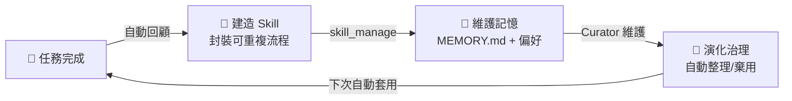
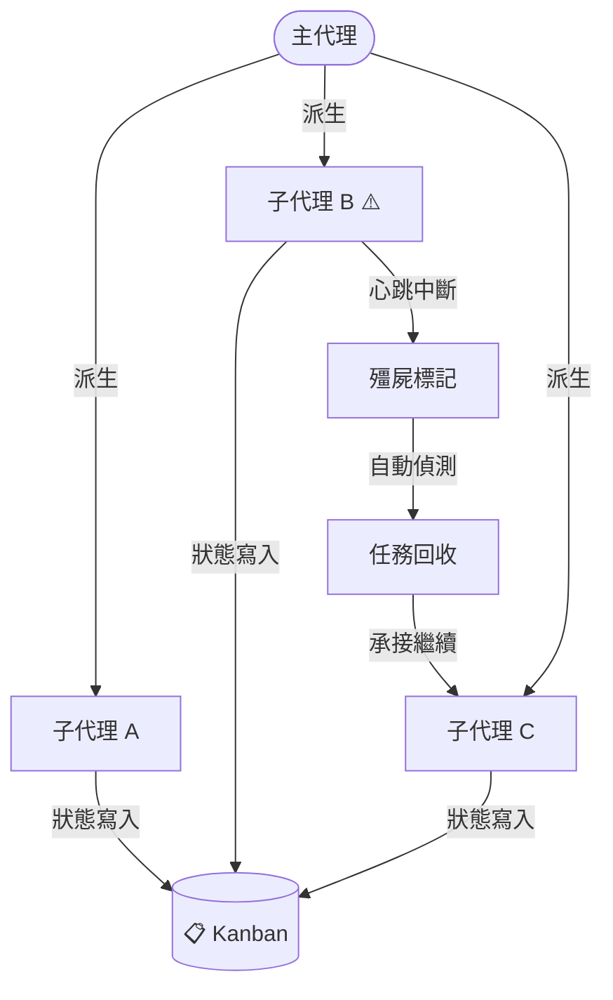
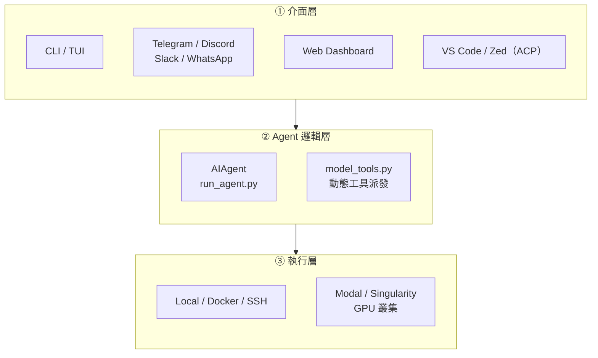

# Hermes Agent

### 自我改進 AI Agent 框架技術評估

  "The Agent That Grows With You"

  Nous Research ・ 技術評估報告 ・ 2026.06.24

<SlideCurrentNo /> / <SlidesTotal />

<!--
今天要跟大家介紹的是 Nous Research 開發的開源 AI Agent 框架——Hermes Agent 的技術評估。
這份報告結合了原始碼分析、實際部署測試，以及企業應用視角，目標是評估它是否值得我們進一步導入。
-->

---
layout: default
---

# Hermes — 從神話到 AI

  

    

      在希臘神話中，<strong class="text-amber-600">赫爾墨斯（Hermēs）</strong>是奧林匹斯十二主神中最靈活的一位——身兼眾神信使、商業之神、邊界之神。
    

    

      他穿梭於神界與人界之間，傳遞訊息、調度資源，從不受邊界束縛。
    

    

      讀音：英文 HUR-meez・法文 air-MEZ
    

  

  

    

      

        
🐎

        
Hermès

        
高級馬具工坊（1837）

      

      

        
🔧

        
Harness

        
測試框架 / 控制套件

      

      

        
🤖

        
Agent

        
駕馭大語言模型

      

    

  

  神話信使・奢華馬具・AI 框架——三個世界，同一個名字

<SlideCurrentNo /> / <SlidesTotal />

<!--
希臘神話中赫爾墨斯的三個特質：靈活、穿梭邊界、傳遞訊息——恰好對應 AI Agent 要做的事：跨工具調度、跨平台操作、傳遞使用者意圖。
Harness 英文還有「駕馭、善用」的意思，做為框架名字非常貼切。
-->
---
layout: two-cols
---

# 專案概覽

<v-clicks>

- **名稱**：Hermes Agent
- **開發方**：Nous Research
- **授權**：MIT（可免費商用）
- **定位**：「The self-improving AI agent」
- **主要語言**：Python 82.6%、TypeScript 13.4%

</v-clicks>

::right::

  

    
201K

    
GitHub Stars

  

  

    
35.8K

    
Forks

  

  

    
1,534

    
Contributors

  

<SlideCurrentNo /> / <SlidesTotal />

<!--
195K stars 代表這不是一個小型實驗專案，是目前 GitHub 上 AI Agent 類別中社群規模最大的之一。
MIT 授權很關鍵：可以自由商用、修改、部署，不需要擔心版權問題。
「self-improving」是最核心的定位，等一下會詳細說明這代表什麼。
-->

---
layout: default
---

# 多模型支援，一套框架

  

| 提供商 | 類型 |
|--------|------|
| OpenRouter | 多模型聚合平台 |
| Nous Portal | Nous 自家模型 |
| OpenAI | GPT 系列 |
| NVIDIA NIM | 企業級推論 |
| Hugging Face | 開源模型 |
| 自訂 Endpoint | 本地 / 私有雲 |

  

  

    

      
💡 對企業的意義

      

        無需改動程式碼即可切換底層模型，降低廠商鎖定風險。未來若有更好或更便宜的模型，可隨時替換。
      

    

  

<SlideCurrentNo /> / <SlidesTotal />

<!--
最重要的一點：Hermes 不綁定任何一家 AI 供應商。
今天用 Claude，明天 GPT-5 出來覺得效果更好或更便宜，改一行 config 就換，不需要重寫任何程式碼。
OpenRouter 是一個聚合平台，一個 API key 可以打 200+ 個模型，是最靈活的接入方式。
-->

<!--
# 多平台整合 — 在現有工具中使用 AI（原P6，已移至 Appendix）

Agent 透過主流通訊平台操作，使用者不需學新介面

  

    

      

        
💬

        
Telegram

      

      

        
🎮

        
Discord

      

      

        
💼

        
Slack

      

      

        
📱

        
WhatsApp

      

      

        
🔒

        
Signal

      

      

        
💼

        
Mattermost

      

      

        
🔒

        
Matrix

      

      

        
📧

        
Email

      

    

    

      📌 <strong>實際場景：</strong>工程師或業務人員直接在 Slack 發指令給 Agent，完成自動化任務，不需切換工具
    

    

      🔥 <strong>精選整合：</strong>Telegram / Discord / Slack / WhatsApp / Signal / Mattermost / Matrix / Email (SMTP)
    

  

  

    
    
Hermes 內建 messaging integrations 列表（部分平台）

  

<SlideCurrentNo /> / <SlidesTotal />

<!--
最大的好處：使用者完全不需要學新的介面或工具。
業務同仁在 Slack 打個訊息，Agent 就去查資料、整理報表、回傳結果。
後面的遊戲營運 Bot 案例就是在 Telegram 上直接操作的，可以感受一下實際的互動體驗。
-->

---
layout: default
---

# 六大核心技術特色

  

    
🧠

    <strong>自我改進學習迴圈</strong>
    
任務完成自動提取可複用技能，越用越聰明

  

  

    
📋

    <strong>SOUL.md 行為控制</strong>
    
Agent 人格可版本控制，各部門隔離管理

  

  

    
💾

    <strong>三層持久記憶</strong>
    
跨對話累積知識，支援全文搜尋與稽核

  

  

    
🛡

    <strong>Promptware 防禦</strong>
    
對抗記憶污染攻擊，v0.15 已加入寫入保護

  

  

    
🤖

    <strong>Multi-agent 自癒</strong>
    
子代理失效自動偵測回收，支援無人值守長任務

  

  

    
🔧

    <strong>工具生態與企業可靠性</strong>
    
Tool Gateway + Plugin + 多層模型保障

  

<SlideCurrentNo /> / <SlidesTotal />

<!--
這六個是讓 Hermes 與其他 Agent 框架不同的地方。
接下來每一項都會有一張獨立的投影片深入說明，包含原始碼層級的確認和企業風險評估。
-->
---
layout: default
---

# Agent 越用越聰明：Learning Loop — 三台引擎

  

    
🔨 造 (Build)

    Agent 把成功流程封裝成 skill，避免重複發明輪子。
  

  

    
💾 修 (Maintain)

    跨對話寫入記憶，支援全文搜尋與稽核，不因換 session 就遺失。
  

  

    
🧬 續 (Evolve)

    Curator 引擎閒置一定時間自動整理/棄用過時 skill，防止知識腐化。
  

  三個引擎分開處理「新建/維護/演化」三件事，缺一就會退化到單純對話机器人。

  
記憶回顧觸發：每 10 回合（使用者訊息計數）

  
技能回顧觸發：每累積 10 次工具呼叫

均可在 config.yaml 調整 nudge_interval・背景 daemon thread 執行，不阻塞使用者回應

<SlideCurrentNo /> / <SlidesTotal />

---
layout: default
---

# `SOUL.md`：Agent 行為的版本控制單元

  

    
~/.hermes/SOUL.md

    

      # 身份 
      你是法務部門的 AI 助理。  
      # 行為邊界 
      不得提供具體法律建議。 
      回應需附加「請諮詢專業律師」。
    

    
啟動時注入 system prompt 前置區段

    

      → 可納入 Git 版控、PR review、CI/CD
    

  

  

    
⚖️ 法務 Agent 合規語氣 + 免責提示

    
🎧 客服 Agent 親切語氣 + 退款授權範圍

    
🛠 工程 Agent 技術語氣 + 生產環境禁令

  

  ⚠️ 純文字，無原生 ACL — 有 HERMES_HOME 寫入權限者可靜默修改人格，建議搭配 OS 層或 Secret Manager 保護

<SlideCurrentNo /> / <SlidesTotal />

<!--
類比 IaC（Infrastructure as Code）——SOUL.md 就是「Agent 行為即程式碼」。
把 Agent 的身份、語氣、授權範圍寫成一份 Markdown 文件，可以 Git 版控。
誰改了 Agent 的行為，commit history 一清二楚；不同部門維護各自的 SOUL.md，互不干擾。
風險必須提：SOUL.md 是純文字，沒有原生的存取控制。
任何有 ~/.hermes/ 寫入權限的人都能靜默修改 Agent 的人格，建議搭配 OS 層檔案權限或 Secret Manager 保護。
-->
---
layout: default
---

# 記憶不中斷：三層記憶架構

  

    

      
短期 — Context Window

      
當前對話即時推理，會話結束即消失

    

    
▼ 每回合結束 sync_all() 寫入

    

      
中期 — SQLite FTS5 全文索引

      
回合結束自動寫入；下回合開始 prefetch_all() 召回相關記憶注入 context

    

    
▼ 每 10 回合 background review 寫入

    

      
長期 — MEMORY.md + 向量 DB

      
由背景 review agent fork 定期寫入；USER.md 記錄使用者偏好 ／ Skill 知識庫

    

  

  

    

      💡 <strong>實際場景</strong> 
      三週後繼續同一專案，無需重新交代背景
    

    

      📋 <strong>稽核友善</strong> 
      MEMORY.md 為純文字，IT 可直接備份與審計；background review fork 受工具白名單保護
    

    

      ⚠️ 寫入 MEMORY.md 的內容由 AI 自主判斷（原始碼無明確過濾規則），企業需評估資料治理策略
    

  

<SlideCurrentNo /> / <SlidesTotal />

<!--
可以類比成三層：工作記憶（context window）、筆記本（SQLite）、知識庫（MEMORY.md）。
最實際的場景：三週後回來繼續上次的工作，不需要重新交代背景——Agent 自己會召回相關記憶。
對 IT 的好處：MEMORY.md 是純文字，不是黑盒子，可以直接備份、稽核、甚至手動編輯。
風險：AI 自主決定要記什麼，原始碼沒有明確的過濾規則，敏感資訊可能被寫入。企業需要考慮資料治理策略。
-->
---
layout: default
---

# Promptware 防禦：對抗記憶污染攻擊

  

    
攻擊鏈（Brainworm-class）

    

      
📄 外部內容（網頁、文件、工具輸出）

      
▼ 混入惡意指令

      
💾 寫入 MEMORY.md / skill_manage

      
▼ 持久化感染

      
🔁 跨會話持續執行攻擊者指令

    

    

      🛡 v0.15.0 在記憶寫入路徑前加入攔截驗證
    

  

  

    
原始碼確認：已有保護

    
✅ Review fork 工具白名單：危險指令全部 auto-deny

    
✅ Fork 隔離：skip_memory=True，不碰外部 memory plugin

    
仍需企業自行處理

    
❌ SOUL.md：純文字，無簽名 / checksum，寫入不留稽核日誌

    
❌ auth.json（OAuth token）與 SOUL.md 同存於 ~/.hermes/

    
⚠️ MCP 工具輸出是否在 Brainworm 防禦範圍內？原始碼未確認

  

<SlideCurrentNo /> / <SlidesTotal />

<!--
Promptware / Brainworm 是一種新型攻擊，專門針對有持久記憶的 AI Agent。
攻擊流程：讓 Agent 讀取含惡意指令的外部內容（例如網頁、文件）→ Agent 把指令寫入 MEMORY.md → 下次對話自動執行攻擊者的指令。
v0.15 已有基本防護，這部分我們有看過原始碼確認。
但仍有兩個企業需要自行處理的缺口：SOUL.md 沒有防篡改機制、auth.json 和 SOUL.md 放在同一個資料夾。
-->
---
layout: two-cols
class: kanban-slide
---

# Multi-agent Kanban 自癒能力

::right::

  
✅ 無人值守長任務：子代理失效不需人工介入

  
✅ 任務狀態可審計：Kanban 提供完整生命週期記錄

  
✅ 跨 session 持久化：配合 /goal 追蹤多日工作流

  

    ⚠️ v0.13.0 推出，尚無公開 benchmark — 建議 PoC 自行驗證可靠性
  

<SlideCurrentNo /> / <SlidesTotal />

<!--
適合場景：需要長時間、多步驟的自動化任務，例如過夜跑的資料處理、多個子任務並行。
主代理派出多個子代理同時工作，Kanban 追蹤所有子代理的狀態。
如果某個子代理沒有回報心跳，系統自動標記為殭屍，任務被其他子代理接手繼續。
不需要人工監看或介入，讓「無人值守長任務」真正可行。
注意：這個功能是 v0.13.0 才加入的，相對較新，建議 PoC 時自行測試可靠性，不要直接用在關鍵流程。
-->
---
layout: default
---

# Tool Gateway — 一訂閱全工具齊備

  

    
隨 Nous Portal 訂閱包含

| 工具 | 說明 |
|------|------|
| 🔍 Web 搜尋 + 擷取 | Firecrawl 無速率限制 |
| 🎨 圖片生成 | FLUX 2 / GPT-Image / Ideogram 等 9 款 |
| 🔊 文字轉語音 | OpenAI TTS 等多款 |
| 🌐 瀏覽器自動化 | 雲端無頭 Chrome（Browser Use） |

  

  

    

      💡 <strong>不需另開帳號：</strong>不必分別申請 Firecrawl、FAL、Browser Use——Tool Gateway 統一路由
    

    

      🛠 企業自建：停用 gateway 改用內部基礎設施（use_gateway: false）
    

    

      ⚠️ 付費功能：Nous Portal 免費方案不含 Tool Gateway
    

  

<SlideCurrentNo /> / <SlidesTotal />

<!--
Tool Gateway 是 Nous Portal 訂閱的附加功能，等於幫你統一管理所有外部工具的帳號、配額和路由。
不需要分別去申請 Firecrawl、FAL、Browser Use 的帳號，Tool Gateway 一個接口全包。
企業如果有資安顧慮不想走外部 gateway，可以設定 use_gateway: false，改接自己的基礎設施。
注意：免費方案沒有這個功能。
-->
---
layout: default
---

# Plugin 系統 — 三種擴充類型

  

    
🔧

    
Tools / Hooks

    
新增自訂工具 + 設置生命週期鉤子（logging、guardrails、webhooks）

    
hermes plugins install

  

  

    
🧠

    
Memory Provider

    
替換記憶後端：Honcho、Mem0、OpenViking、RetainDB 等跨 session 記憶

    
跨 session 個人化

  

  

    
📋

    
Context Engine

    
替換 context 管理，自訂檔案注入與壓縮策略

    
hermes plugins UI

  

  🔒 <strong>企業應用：</strong>Tools/Hooks plugin 可實作 <strong>guardrails</strong>——工具呼叫前後攔截審計，不需 fork 核心程式碼

<SlideCurrentNo /> / <SlidesTotal />

<!--
三種 Plugin 中，對企業最實用的是 Tools/Hooks。
它可以在工具呼叫前後插入攔截邏輯——例如記錄所有查詢、過濾敏感指令、加入審批流程——這就是 guardrails 的實作方式。
重點：不需要 fork 核心程式碼就能加這些控管，升級 Hermes 版本時 plugin 也不受影響。
Memory Provider 可以換成企業自己信任的記憶後端，不依賴 Hermes 預設方案。
-->
---
layout: default
---

# 企業可靠性：多層模型保障

  

    

      
🗺 Provider Routing

      
依成本、速度、品質排序多個提供商，支援白名單 / 黑名單過濾

    

    

      
🔄 Fallback Providers

      
主要模型出錯時自動切換備援，視覺 / 壓縮任務有獨立 fallback

    

    

      
🔑 Credential Pools

      
多組 API Key 輪替，達速率上限自動換鑰，不中斷服務

    

    

      
⚡ Prompt Caching

      
跨 session 1 小時前綴快取（Claude / OpenRouter / Nous Portal），永遠開啟

    

  

  

    

      💡 <strong>SLA 保障</strong> 
      供應商限速或故障時零介入自動切換，服務不中斷
    

    

      💰 <strong>成本控管</strong> 
      Prompt caching 降低重複 context token 費用；Credential Pools 防單鑰達限
    

  

<SlideCurrentNo /> / <SlidesTotal />

<!--
這四個機制合在一起解決兩個企業痛點：服務中斷和成本失控。
Provider Routing + Fallback：主要供應商掛掉或限速，自動切換備援，不需要人工介入，服務不中斷。
Credential Pools：多組 API Key 輪替，任何一組達到速率上限都不會卡住整個服務。
Prompt Caching 是永遠開啟的：重複的 context（例如 SOUL.md、長篇知識庫）不會重複計費，長期使用成本明顯下降。
-->
---
layout: default
---

# 指令審批機制（Command Approval）

  

    
三種審批模式（approvals.mode）+ cron 安全邊界

    

      

        manual
        每次都手動確認（最安全，預設）
      

      

        smart
        LLM 輔助判斷，低風險自動放行、高風險提示確認
      

      

        off
        等同 YOLO，跳過所有審批（不建議）
      

    

    

      cron 任務另設 approvals.cron_mode: deny，排程預設不允許危險指令。
    

  

  

    

      ✅ <strong>企業導入建議：</strong> 
      初期以 suggest 或 ask 模式上線，觀察 Agent 行為穩定後，再針對已知安全操作建立白名單，逐步切換 auto
    

    

      ⚠️ <strong>避免：</strong>在無白名單設定的情況下直接使用 auto 模式——Agent 可能執行任意 shell 指令，等同開放本機執行權限
    

    

      💡 <strong>與 Docker 沙箱互補：</strong> 
      審批機制控制「哪些指令被允許執行」，Docker 沙箱控制「執行後能影響什麼範圍」——兩者應同時啟用
    

  

<SlideCurrentNo /> / <SlidesTotal />

<!--
指令審批是企業部署中最直接的安全控制點——決定 Agent 能做什麼。
四種模式從完全自動到完全拒絕，企業可以根據信任程度和場景靈活配置。
關鍵的雙層防禦概念：審批控制「哪些指令進來」，Docker 沙箱控制「執行後的爆炸半徑」。
兩者缺一不可：只有審批沒有沙箱，AI 被繞過時無底線；只有沙箱沒有審批，使用體驗差且難以追責。
-->
---
layout: default
---

# 資安全貌：風險與企業部署建議

  

    
架構層面風險

    

      
⚠️ 進程內防護均為<strong>啟發式（heuristics）</strong>，非真正安全邊界；LLM 被對抗操控時可被繞過

      
⚠️ <code>SOUL.md</code> / <code>MEMORY.md</code>：純文字、無 ACL、無簽名，有寫入權限可靜默篡改人格與記憶

      
⚠️ Skills / Plugins 與主進程同等權限，無自動沙箱，安裝前審查責任落在操作員

      
⚠️ API 金鑰明文儲存於 <code>~/.hermes/.env</code>，不支援 Vault / KMS

      
✅ 供應鏈：內建 OSV-Scanner CI；litellm / mistralai 投毒事件已列入掃描清單

      
✅ 無已知直接歸屬 Hermes Agent 的 CVE

    

  

  

    
企業部署優先建議

    

      

        高
        啟用 Docker 沙箱（<code>terminal.backend: docker</code>）——預設 local backend 無容器隔離
      

      

        高
        Gateway 嚴格白名單；絕不使用 <code>GATEWAY_ALLOW_ALL_USERS=true</code>
      

      

        高
        以非 root 用戶運行，設定 CPU / 記憶體資源上限
      

      

        中
        Skills 安裝前強制人工 code review（Skills 為 Python 程式碼）
      

      

        中
        OSV-Scanner 改設 <code>fail-on-vuln: true</code>（預設為警告、不擋關）
      

      

        中
        考慮 HashiCorp Vault / Bitwarden Secrets 替代明文 .env
      

    

  

  資安成熟度：🟡 成長中
  誠實揭露防護邊界、有完整 Threat Model，但預設部署姿態非最安全——技術能力充足的企業在容器隔離後可部署，暫不建議高敏感生產環境以預設配置直接使用

<SlideCurrentNo /> / <SlidesTotal />

<!--
這頁是技術特色章節的資安總結，整合所有特色的風險面向。
重點一：沒有已知 CVE 是好消息；供應鏈風險是真實存在的，litellm 和 mistralai 都曾發生投毒，Hermes 的應對是內建 OSV-Scanner。
重點二：官方 SECURITY.md 自承，所有進程內機制（審批門、輸出編輯、模式掃描）都是「啟發式」，不是真正安全邊界。唯一的真正邊界是 OS 沙箱（Docker）。
重點三：預設部署不是最安全配置，企業上線前必須主動啟用 Docker 沙箱、設 Gateway 白名單、限制資源。
整體定位：比同類開源 AI Agent 框架更有資安自覺，但尚不到「企業開箱即用」的成熟度。
-->
---
layout: default
---

# Token 消耗 — 實際用量與成本分析

Hermes 實際 API 用量（2026-06-18 ~ 2026-06-22）

  <table class="table-auto border-collapse w-full text-xs">
    <thead>
      <tr class="bg-gray-100">
        <th class="border border-gray-300 px-2 py-1 text-left">日期</th>
        <th class="border border-gray-300 px-2 py-1 text-left">模型</th>
        <th class="border border-gray-300 px-2 py-1 text-right">Token 用量</th>
        <th class="border border-gray-300 px-2 py-1 text-right">成本（USD）</th>
      </tr>
    </thead>
    <tbody>
      <tr>
        <td class="border border-gray-300 px-2 py-1">2026-06-22</td>
        <td class="border border-gray-300 px-2 py-1 font-mono">claude-sonnet-4-6</td>
        <td class="border border-gray-300 px-2 py-1 text-right font-mono">11,579,765</td>
        <td class="border border-gray-300 px-2 py-1 text-right font-mono text-green-600">$8.71</td>
      </tr>
      <tr>
        <td class="border border-gray-300 px-2 py-1">2026-06-22</td>
        <td class="border border-gray-300 px-2 py-1 font-mono">stepfun/step-3.7-flash:free</td>
        <td class="border border-gray-300 px-2 py-1 text-right font-mono">12,065,283</td>
        <td class="border border-gray-300 px-2 py-1 text-right font-mono text-green-600">$1.33</td>
      </tr>
      <tr>
        <td class="border border-gray-300 px-2 py-1">2026-06-19</td>
        <td class="border border-gray-300 px-2 py-1 font-mono">claude-sonnet-4-6</td>
        <td class="border border-gray-300 px-2 py-1 text-right font-mono">198,187</td>
        <td class="border border-gray-300 px-2 py-1 text-right font-mono text-green-600">$0.15</td>
      </tr>
      <tr>
        <td class="border border-gray-300 px-2 py-1">2026-06-18</td>
        <td class="border border-gray-300 px-2 py-1 font-mono">claude-sonnet-4-6</td>
        <td class="border border-gray-300 px-2 py-1 text-right font-mono">9,546,855</td>
        <td class="border border-gray-300 px-2 py-1 text-right font-mono text-green-600">$5.60</td>
      </tr>
      <tr>
        <td class="border border-gray-300 px-2 py-1">2026-06-18</td>
        <td class="border border-gray-300 px-2 py-1 font-mono">stepfun/step-3.7-flash:free</td>
        <td class="border border-gray-300 px-2 py-1 text-right font-mono">21,102,926</td>
        <td class="border border-gray-300 px-2 py-1 text-right font-mono text-green-600">$2.14</td>
      </tr>
    </tbody>
  </table>

  

    
模型分散

    Sonnet 4-6 用於高推理任務，Step 3.7 Flash 處理大量輕量請求，兩者並行執行。
  

  

    
成本落差

    Sonnet $8.71 vs Step $1.33（同一天）：相同 token 量，成本差 6.5 倍。
  

  

    
整體控制

    5 天總花費 $17.93，平均每天 ~$3.59。
  

  💡 Prompt caching + Credential Pools 已啟用；免費模型 Step 3.7 Flash 大幅降低批量處理成本，但推理能力較弱。

<SlideCurrentNo /> / <SlidesTotal />

---
layout: default
---

# 適用場景 vs 不適用場景

  

    
✅ 適合導入的場景

    

      
🔍 非技術人員用自然語言查內部資料（已驗證，見案例）

      
🔄 IT / 工程部門重複性自動化任務

      
🤖 需要多步驟無人值守的長任務（配合 Multi-agent Kanban）

      
🏢 多部門各自維護行為隔離的 AI 助理（SOUL.md 分離管理）

      
🔀 需靈活切換底層模型、降低廠商鎖定的場合

    

  

  

    
⚠️ 需謹慎或暫緩的場景

    

      
🏦 高合規監管環境（金融、醫療、法務）以預設配置直接上線

      
🔒 需要細粒度 ACL 的場合（SOUL.md / MEMORY.md 無原生存取控制）

      
🛠 無 Python 能力自建 guardrails，且無監管直接部署

      
⚙️ 自動生成的 Skill（Python 程式碼）直接進生產環境，無 code review 流程

    

  

  核心前提：啟用 Docker 沙箱 + 指令審批白名單後，上述「謹慎」項目風險可大幅降低

<SlideCurrentNo /> / <SlidesTotal />

<!--
這頁是技術評估章節的收尾，把所有技術特色和資安分析轉化為「能用/不能用」的直接答案。
左欄是已驗證或有強理由的適合場景；右欄是需要額外準備或有已知缺口的場景。
最下方的「核心前提」很重要：Docker + 白名單不是可選項，是把右欄風險降到可接受範圍的必要條件。
-->
---
layout: center
class: text-center
---

# 實際落地案例

遊戲營運 AI Bot — 自然語言查 BigQuery 的實戰驗證

<SlideCurrentNo /> / <SlidesTotal />

<!--
接下來是我們自己實際跑的一個案例，用來驗證 Hermes Agent 在我們業務場景的實際能力。
場景是遊戲營運團隊每天需要查 BigQuery 資料做分析，但不是每個人都會寫 SQL。
-->
---
layout: default
---

# 遊戲營運 Bot：用中文提問，Bot 自動出報告

  Hermes Agent + BigQuery，遊戲運營同仁無需寫 SQL，直接提問得到完整對比分析

  

    
對話實例

    

      
使用者 · 14:32

      

        黃金週與卡片最終戰成效交叉比對一下
      

      
RD7 Bot · 14:35

      

        FXC 最終戰 × 黃金週 BP 交叉比對 (非CN) 
        查詢區間：2026/4/1 – 5/4  
        結論先講： 
        FXC 最終戰仍是營收主力，BP 營收占 88%。Round B 日均較 Round A 下滑 28.5%…
      

    

  

  

    
Bot 在這次對話做了什麼？

    

      
🗣 理解需求

      
把「黃金週 vs 卡片最終戰」翻成可查的條件

    

    

      
🔍 查資料

      
自動到 BigQuery 跑日均、營收、買家重疊

    

    

      
📊 做對比，下結論

      
Round A vs B 日均公平對比，用人話解釋數字

    

  

<SlideCurrentNo /> / <SlidesTotal />

<!--
這是真實的對話紀錄，不是精心設計的 demo。
使用者用一句中文提問，Bot 在大約 3 分鐘內自動：理解業務語意 → 轉成 BigQuery SQL → 執行查詢 → 整理成對比報告。
使用者完全不需要懂 SQL，也不需要知道資料在哪張表。
「結論先講」的輸出格式是我們在知識庫裡定義的規則，Bot 自動遵守。
-->
---
layout: center
class: text-center
---

# 資料準備

Bot 要懂業務，得先給它正確的『地圖』和『字典』

DATA · KNOWLEDGE · QUERIES

<SlideCurrentNo /> / <SlidesTotal />

<!--
Bot 能正確回答的前提，是我們事先把業務知識餵給它。
這是一次性的準備工作，之後 Bot 會自己學習和更新。
接下來三張投影片說明我們準備了哪三類知識。
-->
---
layout: default
---

# Bot 要餵的三類知識

少了哪一塊都會卡住：表結構、能跑的範例、聽得懂的詞彙

  

    
01 · 數據儀表

    

      
BigQuery 表的中文名、用途、寫入頻率、欄位語意。Bot 才知道「要打開哪張表」。

      
EXAMPLES

      
DailyUserInfoSnapshot · GameAccount · ...

    

  

  

    
02 · 歷史 Query 範例

    

      
把過去寫過的查 SQL 收進來。Bot 用最像的範本改造，避免從零亂湊。

      
EXAMPLES

      
計算 DAU · 計算營收 · 留存 · 重疊買家

    

  

  

    
03 · 一般營運知識

    

      
縮寫、行話、人話對映：DAU 是什麼、員工要不要排除、CN 什麼定義…

      
EXAMPLES

      
DAU = 日活躍 · DNU = 新玩家 · DOU = 老玩家

    

  

<SlideCurrentNo /> / <SlidesTotal />

<!--
三類知識缺一不可：
01 數據儀表：讓 Bot 知道「去哪找資料」——沒有這個，Bot 不知道要查哪張表。
02 歷史 Query：讓 Bot 有正確的 SQL 範本可以改——沒有這個，Bot 容易從零亂湊出錯誤的查詢。
03 營運知識：讓 Bot 理解業務語言——沒有這個，Bot 可能把「新進」誤當「活躍」，算出完全不同的數字。
-->
---
layout: default
---

# 社群驗證：262 則真實案例

  

    
    
hermes-agent.nousresearch.com/docs/user-stories

  

  

    
Business Ops 精選場景

    

      
定時自動推報

      
「每個工作日早上 9 點整理收件夾推到 Slack」——現有 BQ Bot 延伸：每日 KPI 摘要主動推送，不需人工觸發

    

    

      
會議記錄自動化

      
自動轉錄 Google Meet／Teams，產出摘要與行動項目；敏感資料走本地模型不出機器

    

    

      
多遊戲 Chief of Staff 架構

      
主 Agent 跨專案統覽；每個遊戲 / 部門有獨立 sub-agent + 各自記憶，1 個 Slack 頻道 = 1 個 Agent

    

    
來源：官方 User Stories · Enterprise / Business Ops 分類

  

<SlideCurrentNo /> / <SlidesTotal />

<!--
這頁說明我們自己的 BQ Bot 不是孤例——官方文件有 262 則來自社群的真實案例，涵蓋 15 個分類。
Enterprise 分類有 9 則，Business Ops 有 16 則，都是真實的企業或團隊部署。
三個延伸場景：定時推報（現有 Bot 功能延伸）、會議記錄（可立即應用）、多遊戲 Chief of Staff（組織擴展的藍圖）。
-->
---
layout: default
---

# 評估結論

  

    
它能做什麼？

    <ul class="text-xs text-gray-700 space-y-2">
      <li>✅ 非技術人員自然語言查資料 （已驗證：遊戲營運 Bot）</li>
      <li>✅ 跨工具自動化重複性任務</li>
      <li>✅ 多 Agent 無人值守長任務</li>
      <li>✅ 各部門隔離的 AI 助理 （SOUL.md 行為控制）</li>
    </ul>
  

  

    
資安風險如何？

    <ul class="text-xs text-gray-700 space-y-2">
      <li>✅ 無已知 CVE，有主動 Threat Model</li>
      <li>⚠️ 進程內防護為啟發式，非真正隔離</li>
      <li>⚠️ 預設部署非最安全配置</li>
      <li>🟡 <strong>容器化後</strong>可接受部署於非高敏環境</li>
    </ul>
  

  

    
下一步

    <ul class="text-xs text-gray-700 space-y-2">
      <li>🎯 啟動一個月 PoC $5 VPS ≈ NT$160</li>
      <li>🐳 Docker 沙箱 + Gateway 白名單為基本前提</li>
      <li>📋 以遊戲營運查詢為起點，驗證業務場景</li>
      <li>🔒 確認資料治理策略後再擴大部署</li>
    </ul>
  

  <strong>MIT 授權・195K Stars・Python 技術能力前提</strong>——技術能力充足的前提下，列為內部 AI Agent 基礎框架候選，建議以容器隔離 + 白名單管控在非高敏環境啟動 PoC。

<SlideCurrentNo /> / <SlidesTotal />

<!--
三欄直接回答評估的核心問題。
能做什麼：遊戲營運 Bot 是已驗證的場景，不是假設。
資安：定性是「成長中」——無 CVE、有誠實揭露，但需要企業主動配置，不能開箱即用。
下一步：PoC 門檻極低，NT$160 就能在真實業務場景驗證，沒有不試的理由。
-->
---
layout: default
---

# 資料來源

  

    
GitHub Repo

    
github.com/NousResearch/hermes-agent

  

  

    
官方文件

    
hermes-agent.nousresearch.com/docs

  

  

    
繁中教學手冊（chihhung, v0.15.2）

    
chihhung.github.io/Blog/posts/教學/ai開發/hermes-agent生態系教學手冊

  

  

    
DeepWiki — code-level 架構分析

    
deepwiki.com/NousResearch/hermes-agent

  

<SlideCurrentNo /> / <SlidesTotal />

<!--
這份報告主要參考了四個來源。
DeepWiki 特別值得推薦：它會自動分析 GitHub repo 的程式碼並生成架構文件，對想深入了解 Hermes 內部實作的人很有幫助。
有興趣深入研究的同仁可以從 DeepWiki 開始。
-->
---
layout: center
class: text-center
---

# 謝謝

  報告日期：2026.06.12

  Co-author：佳宏 — 技術評估與內容審閱

  Co-author：小赫（Hermes Agent）— 協助投影片內容編修與自動化流程

  Co-author：Claude（Anthropic）— 原始碼分析、資安風險審查、投影片內容編修

<SlideCurrentNo /> / <SlidesTotal />

<!--
開放 Q&A。
如果有關於資安評估、PoC 規劃、或技術細節的問題，歡迎提出。
-->
---
layout: center
class: text-center
---

# Appendix

## 附錄A：多模型支援 — 200+ 模型，一套框架（原P4，已由主要流程移除）

  

| 提供商 | 類型 |
|--------|------|
| OpenRouter | 多模型聚合平台 |
| Nous Portal | Nous 自家模型 |
| OpenAI | GPT 系列 |
| NVIDIA NIM | 企業級推論 |
| Hugging Face | 開源模型 |
| 自訂 Endpoint | 本地 / 私有雲 |

  

  

    

      
💡 對企業的意義

      

        無需改動程式碼即可切換底層模型，降低廠商鎖定風險。未來若有更好或更便宜的模型，可隨時替換。
      

    

  

<SlideCurrentNo /> / <SlidesTotal />

最重要的一點：Hermes 不綁定任何一家 AI 供應商。
今天用 Claude，明天 GPT-5 出來覺得效果更好或更便宜，改一行 config 就換，不需要重寫任何程式碼。
OpenRouter 是一個聚合平台，一個 API key 可以打 200+ 個模型，是最靈活的接入方式。

---

案例實作細節參考

<SlideCurrentNo /> / <SlidesTotal />

<!--
以下為案例設定的詳細知識庫參考資料，供有需要深入了解實作細節的同仁參考。
-->
---
layout: default
---

# 數據儀表｜DailyUserInfoSnapshot

非即時主表，覆蓋玩家屬性 + 每日聚合，是 Bot 跑分析的第一站

  

    
TABLE METADATA

    

      
table_idpreprocessed_bklog. DailyUserInfoSnapshot

      
中文表名日結玩家聚合資訊

      
table_typeIntermediate

      
write_frequencyDaily

      
business_domain玩家

      
partitionsBQDate

    

  

  

    
BOT 最常用的欄位

    

      
BQDate日期 partition（REQUIRED）

      
UserID玩家 ID

      
Country主要市場：CN/JP/TW/US/VN/Others

      
VipLV當日最高 VIP

      
GameLevel當日最高遊戲等級

      
BuyNumber營收（不需排除員工）

      
EndBalance持有通算金幣（金幣水位）

      
UserType30日活躍 / 新進 / 30日回流

      
LastBuyDate180 天內最近一次購買

      
BPBuyNumber付費 BP 儲值金額

    

  

<SlideCurrentNo /> / <SlidesTotal />

<!--
DailyUserInfoSnapshot 是 Bot 跑非即時分析的主要入口，幾乎所有 DAU、營收、留存查詢都從這裡出發。
重要的業務口徑：BQDate 是 partition 欄位，每次查詢都必須指定，否則費用爆炸。
BuyNumber 是營收欄位，不需要排除員工；但 DAU 等人數查詢要排除員工帳號（在 GameAccount 表）。
這些規則我們寫進了知識庫，Bot 自動遵守。
-->
---
layout: default
---

# 歷史 Query 範例

把過去寫得不錯的 SQL 收進來，Bot 找最像的當範本改

  

    
計算 DAU &nbsp;·&nbsp; dim: BQDate

    <pre class="bg-gray-50 rounded p-3 text-xs font-mono leading-snug">/* 非即時資料 → 用 DailyUserInfoSnapshot */
/* 非營收資料 → 排除員工 */
SELECT BQDate,
  count(distinct UserID) AS DAU
FROM `DailyUserInfoSnapshot`
WHERE BQDate BETWEEN '2025-08-08'
  AND '2025-08-10'
  AND UserID NOT IN (
    SELECT UserID FROM `GameAccount`
  )
GROUP BY BQDate
ORDER BY BQDate</pre>
  

  

    
計算營收 &nbsp;·&nbsp; dim: BQDate

    <pre class="bg-gray-50 rounded p-3 text-xs font-mono leading-snug">/* 非即時資料 → 用 DailyUserInfoSnapshot */
/* 營收資料 → 不需排除員工 */
SELECT BQDate,
  sum(BuyNumber) AS BuyNumber
FROM `DailyUserInfoSnapshot`
WHERE BQDate BETWEEN '2025-08-08'
  AND '2025-08-10'
GROUP BY BQDate
ORDER BY BQDate</pre>
  

<SlideCurrentNo /> / <SlidesTotal />

<!--
Bot 使用 RAG（檢索增強生成）機制：收到問題後，先找和使用者需求最相似的歷史 SQL，再修改日期範圍、條件，輸出正確的查詢。
左右兩張的差異：DAU 需要 NOT IN GameAccount 排除員工；營收不需要——這個口徑差異就靠範例 SQL 的註解傳達給 Bot。
-->
---
layout: default
---

# 一般營運知識｜給 Bot 的字典

把行話、縮寫、規則寫清楚，Bot 才不會把「新進」當「活躍」回給你

  

    
INDICATORS

    

      
DAU日活躍玩家數 (Daily Active Users)

      
DNU每日新玩家數 (Daily New Users)

      
DOU每日老玩家數 (Daily Old Users)

      
BP 營收付費 BP 儲值金額（BPBuyNumber）

      
黑鑽BlackDiamondTag 標示的高價值玩家

      
金幣水位EndBalance：玩家當日持有通算金幣量

      
30日活躍前 30 天內有上線紀錄的玩家

      
30日回流前 30 天有過上線、但今日不是新進

    

  

  

    
BOT 預設遵守的營運規則

    

      
非即時數據需求：一律走 DailyUserInfoSnapshot

      
非營收查詢：UserID 排除 GameAccount 員工帳號

      
營收查詢：不需排除員工

      
Country = Others 時，看 CountryDetail 取精準國家

      
通算金幣 = Coin + 25000 × Gem（贈幣同口徑）

      
回答先給結論，再附支持的數字與 SQL

    

  

<SlideCurrentNo /> / <SlidesTotal />

<!--
這份字典解決了 AI 不懂業務語言的問題。
沒有這個，Bot 可能把「新進」誤解為「活躍」，算出完全錯誤的用戶數。
通算金幣的公式（Coin + 25000 × Gem）是特別非直覺的業務規則，這種知識最需要明確告訴 Bot。
通算金幣的公式（Coin + 25000 × Gem）是特別非直覺的業務規則，這種知識最需要明確告訴 Bot。
-->
---
layout: default
---

## 附錄C：架構解析 — 三層設計（原P7，已由主要流程移除）

<SlideCurrentNo /> / <SlidesTotal />

三層分離讓我們可以「換一層不動另一層」。
例如：今天用 Slack，改天想換成 Line，只需要改介面層的設定，Agent 邏輯完全不用動。
或者：現在在本機跑，之後要擴展到 GPU 叢集，也只是換執行層，程式碼不變。
這個設計對企業長期維護很友善。

---
layout: default
---

## 附錄B：部署彈性 — 從個人到企業規模（原P5，已由主要流程移除）

  

    <h3 class="text-green-700 mb-4">🚀 輕量部署</h3>
    <ul class="space-y-2 text-sm">
      <li>✅ 本機終端機（立即可用）</li>
      <li>✅ $5/月 VPS（低成本驗證）</li>
      <li>✅ Docker 容器化</li>
      <li>✅ SSH 遠端機器</li>
    </ul>
  

  

    <h3 class="text-blue-700 mb-4">🏢 企業部署</h3>
    <ul class="space-y-2 text-sm">
      <li>✅ GPU 叢集（Singularity）</li>
      <li>✅ Serverless（Modal）</li>
      <li>✅ 雲端沙箱（Daytona）</li>
      <li>✅ 多平台訊息閘道</li>
    </ul>
  

<SlideCurrentNo /> / <SlidesTotal />

PoC 的門檻非常低：$5/月的 VPS，大約台幣 160 元，就能把 Hermes 跑起來。
不需要先投入大量基礎設施成本就能驗證可行性。
如果 PoC 成功，同一套程式碼可以直接擴展到 GPU 叢集，不需要重寫。
這個彈性讓「先試再說」的策略非常合理。
---
layout: default
---

# 架構解析 — Runtime Modes & 設定

  

    
四種啟動入口

| Mode | Entry Point |
|------|-------------|
| CLI | `cli.py` |
| 訊息平台 Gateway | `gateway/run.py` |
| Editor (ACP) | VS Code / Zed 整合 |
| Web UI | 瀏覽器 Dashboard |

  

  

    
HERMES_HOME（~/.hermes/）

    

      
config.yaml — 模型、工具設定

      
SOUL.md — Agent 人格定義

      
MEMORY.md — 長期記憶

      
.env — API 金鑰

    

  

<SlideCurrentNo /> / <SlidesTotal />

<!--
右邊的 SOUL.md 和 MEMORY.md 是後面深入解析的重點，先記住它們的存在。
所有設定集中在 ~/.hermes/ 這個資料夾，部署和備份都很容易。
四種啟動模式覆蓋了大部分的企業使用場景：CLI 給工程師，Gateway 給業務通訊，Web UI 給管理者。
-->
---
layout: default
---

# Curator 四道剎車：防止自改進失控

  

    
四個抑制層，回答企業最擔心的事

    

      

        01
        閒置觸發：min_idle_hours 設下限，不會剛學完就清理
      

      

        02
        逾時歸檔：archive_after_days 強制封存，不隨意刪除
      

      

        03
        版本保留：backup.keep 最多保留 5 份，可 rollback
      

      

        04
        最小閾值：stale_after_days 過了才視為過期
      

    

  

  

    

      ✅ **每個參數都可配置**，企業可依法規要求（金融、醫療）調高保留天數。
    

    

      💡 **與 Promptware 對齊**：自改進不是單靠「自動學習」，而是「自動學習 + 自動治理」。
    

    

      ⚠️ 企業注意：四個閾值預設值未必符合所有產業，導入前應 review config.yaml。
    

  

<SlideCurrentNo /> / <SlidesTotal />

---
layout: default
---

# Curator 四道剎車（續）— 參數對照表

  <table class="table-auto border-collapse w-full text-xs">
    <thead>
      <tr class="bg-gray-100">
        <th class="border border-gray-300 px-2 py-1 text-left">參數</th>
        <th class="border border-gray-300 px-2 py-1 text-left">預設值</th>
        <th class="border border-gray-300 px-2 py-1 text-left">用途</th>
        <th class="border border-gray-300 px-2 py-1 text-left">企業調校建議</th>
      </tr>
    </thead>
    <tbody>
      <tr>
        <td class="border border-gray-300 px-2 py-1 font-mono">min_idle_hours</td>
        <td class="border border-gray-300 px-2 py-1">2</td>
        <td class="border border-gray-300 px-2 py-1">多久沒用才視為閒置</td>
        <td class="border border-gray-300 px-2 py-1">金融/醫療調高至 24</td>
      </tr>
      <tr>
        <td class="border border-gray-300 px-2 py-1 font-mono">interval_hours</td>
        <td class="border border-gray-300 px-2 py-1">168</td>
        <td class="border border-gray-300 px-2 py-1">Curator daemon 執行頻率</td>
        <td class="border border-gray-300 px-2 py-1">嚴格環境調低（每 24h）</td>
      </tr>
      <tr>
        <td class="border border-gray-300 px-2 py-1 font-mono">stale_after_days</td>
        <td class="border border-gray-300 px-2 py-1">30</td>
        <td class="border border-gray-300 px-2 py-1">多少天沒更新標記為過期</td>
        <td class="border border-gray-300 px-2 py-1">快速變動領域調低至 14</td>
      </tr>
      <tr>
        <td class="border border-gray-300 px-2 py-1 font-mono">archive_after_days</td>
        <td class="border border-gray-300 px-2 py-1">90</td>
        <td class="border border-gray-300 px-2 py-1">過期多久強制封存</td>
        <td class="border border-gray-300 px-2 py-1">法規要求調低至 30 或不归档</td>
      </tr>
      <tr>
        <td class="border border-gray-300 px-2 py-1 font-mono">backup.keep</td>
        <td class="border border-gray-300 px-2 py-1">5</td>
        <td class="border border-gray-300 px-2 py-1">最多保留備份份數</td>
        <td class="border border-gray-300 px-2 py-1">依磁碟空間調整，不可為 0</td>
      </tr>
    </tbody>
  </table>

  資料來源：hermes_agent/hermes-agent/hermes_cli/config.py 段落 curator.

<SlideCurrentNo /> / <SlidesTotal />

